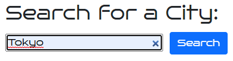
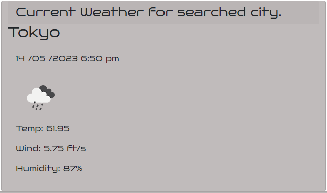
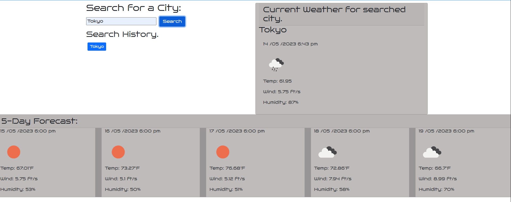
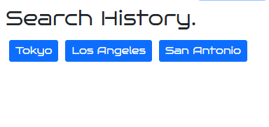

# Weather_Dashboard_App

## Description

This application was built in order to help prepare vacations better depending on the weather forecast of the place the traveler wants to visit.
I made this application to help travelers check the current weather and the forecast for the following 5 days so they can prepare in advance dependeing on how the weather will be during their visit to the selected city.
This was acheived by calling the OpenWeatherMap API (https://openweathermap.org/api) and using the different type of calls you can make in order to retrieve the coordinates of the searched place, and then obtaining the weather and forecast for the next 5 days.

## Usage

For the correct usage of the application write into the form field the name of the city you want to search and learn about the current weather and the weather forecast of the next 5 days. Steps for use:

1.- Enter the place for which you wish to learn about the weather as shown in the picture below:

2.- Check the Current Weather for searched city for the information about the current weather:

3.- Below are the results of the forecast for the next 5 days, as shown in the picture below:

4.- Finally in order to help keep track of the cities the user has searched during its visit a buttun is created in order to help the user check that place's weather again without the need to type again the name of the city inside the form field.

## Credits

This was completely made by me!!!

## Link to webpage

https://enrique-v06.github.io/HEVM-Challenge-6/